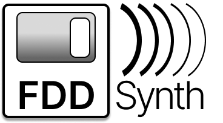

# HDD Synth

  

### Recreates the sound of mechanical spinning FDDs on retro PCs that use a solid state floppy drive.

The first project I created was the [HDD Synth](https://github.com/MaverickUK/HDDSynth) and so bringing the sound back to floppy disk drives felt like the next logical step.

The FDD Synth listens to the signals on the FDD cable that indicate when the motor is spinning and when the head is moving. It essentially recreates those physical actions in software, meaning that when the FDD motor starts spinning the disk it'll play a short spinup sound before a looping spin sound continues. FDD head movement is monitored and replicated with a short click for small movement along with hum of move rapid track changes. 

## Features

- **Plug and Play**: Uses FDD cable to monitor the exact FDD activity, so all you have to do it plug it in
- **SD Card Storage**: Audio samples stored on removable SD card for easy customization
- **Configurable**: Future software based enhancements planned

## Progress
### 🔄  Phase 1: Breadboard prototype
### 🔄 Phase 2: PCB prototype
### 🌱 Phase 3: PCB final 

<!-- ## Media
[View gallery](media.md) -->

## Contact
Peter Bridger at [maverickuk@gmail.com](maverickuk@gmail.com)

<!--
## Resources

## Acknowledgments
-->

## License
This project is licensed under the GNU General Public License v3.0.

- **Permissions:** Commercial use, modification, and distribution are allowed.
- **Conditions:** You must include a copy of the license and the source code for any derivative works.
- **Prohibitions:** You cannot close the source or use a different license for derivative works.